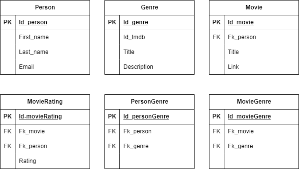
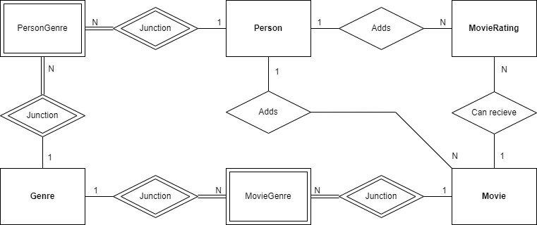

# Film-System

## Overview

This is a ASP.NET Core Web API application developed for creating the possibility to access data from a local database.
The program includes the use of an external API which retrieves data related to the data stored in the local database.

TMDB (The Movie Database) is the source for the external API.

<picture>
Feel free to visit their website:

</picture>

## Functionality

## Structure

### Code Structure

### Database Structure

Below image shows the tables the Film System database consists of:
<picture>

</picture>

Below image show an ER-diagram which displays the relationship between the tables:
<picture>

</picture>

## Reflection

## Tools

All of the tools used during the development of this program:

#### Integrated Development Environment (IDE)

- Visual Studio

#### Relational Database Management System (RDBMS)

- SQL Server 2022

#### Database Client (GUI)

- Microsoft SQL Server Management Studio 19

#### Dependencies / Packages

- Microsoft.EntityFrameworkCore (6.0.16)
- Microsoft.EntityFrameworkCore.SqlServer (6.0.16)
- Microsoft.EntityFrameworkCore.Tools (6.0.16)
- Swashbuckle.AspNetCore (6.2.3)
- Newtonsoft.Json (13.0.3)

### Design Pattern

- Repository Pattern

### Object Relational Mapping (ORM)

- Entity Framework

#### Languages

- C#
- SQL
